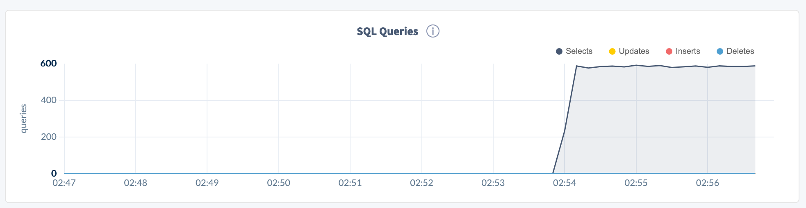
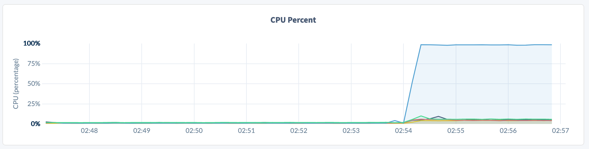
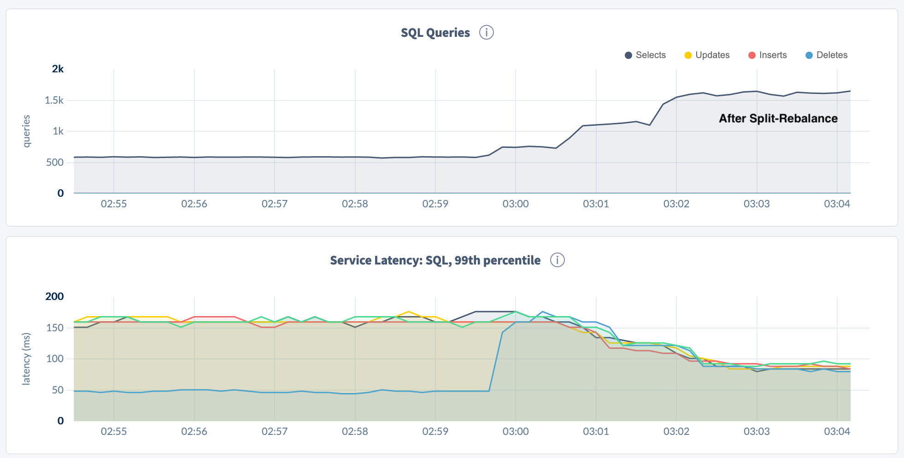
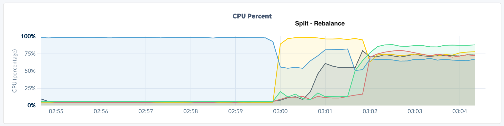

# Reproduce small table single range hotspotting

The following will setup an environment to reproduce the single hotrange in a small table for demonstration purposes.  

## Create Cluster and Driver Machine
Create a simple 5 node cluster in single range.  I am using a simple tool [roachprod](https://github.com/cockroachdb/roachprod) used internally at CRDB to create and tear-down clusters.  Really any tool to create a cluster could be used to spin this up.

**Cluster Creation:**
```bash
roachprod create `whoami`-hotrange --gce-machine-type 'n1-standard-2' --nodes 5 --lifetime 24h
roachprod stage `whoami`-hotrange release v20.2.3
roachprod start `whoami`-hotrange
```
Record the *internal* ip addressed used to access the cluster from your VPN.  This will be used below to configure HAproxy to load balance connections in the cluster.

```bash
--Show Internal IP addresses for the hotrange cluster
--
roachprod pgurl `whoami`-hotrange:1 
```

The following driver machine is used to drive load across all 3 target nodes in the cluster through a load balancer.  A separate machine is used for this activity to best simulate a real microservices environment and remove *client* cpu load from the test. 

**Driver Machine Creation**

```bash
## Create Driver VM
##
roachprod create `whoami`-drive --gce-machine-type 'n1-standard-2' --nodes 1 --lifetime 24h
roachprod stage `whoami`-drive release v20.2.3  

## Configure Driver VM to drive load
##
roachprod ssh `whoami`-drive:1
sudo mv ./cockroach /usr/local/bin  ## Use cockroach binary for client connection

## Download workload binary
wget https://edge-binaries.cockroachdb.com/cockroach/workload.LATEST
chmod 755 workload.LATEST
sudo mv -i workload.LATEST /usr/local/bin/workload
sudo chmod u+x /usr/local/bin/workload

## Configure HA Proxy
sudo apt-get update -y
sudo apt-get install haproxy -y

## Replace 99.99.99.99 IP address from one of the cluster nodes
##
# cockroach gen haproxy --insecure   --host=99.99.99.99   --port=26257 
cockroach gen haproxy --insecure   --host=10.142.0.59   --port=26257 
nohup haproxy -f haproxy.cfg &

```

## Create Test Database and Table
A simple test table has been created so that it fits within a *single* range.

Connect to database via SQL: `cockroach sql --insecure` and running the following:

```sql
CREATE DATABASE test;

USE test;

-- select bit_length(lpad('',64,'{'));
--   bit_length
-- --------------
--         512

CREATE TABLE hotsingle (
    id INT PRIMARY KEY,
    s1 string NOT NULL DEFAULT 'aaaaaaaaaaaaaaaaaaaaaaaaaaaaaaaaaaaaaaaaaaaaaaaaaaaa',
    s2 string NOT NULL DEFAULT 'bbbbbbbbbbbbbbbbbbbbbbbbbbbbbbbbbbbbbbbbbbbbbbbbbbbb',
    s3 string NOT NULL DEFAULT lpad('',64,'{'),
    s4 string NOT NULL DEFAULT 'dddddddddddddddddddddddddddddddddddddddddddddddddddd',
    s5 string NOT NULL DEFAULT 'eeeeeeeeeeeeeeeeeeeeeeeeeeeeeeeeeeeeeeeeeeeeeeeeeeee'
);

INSERT INTO hotsingle (id)
SELECT i from generate_series(1,500000) as i;

SHOW RANGES FROM TABLE hotsingle;

root@:26257/test> SHOW RANGES FROM TABLE hotsingle;
  start_key | end_key | range_id | range_size_mb | lease_holder |           lease_holder_locality           | replicas |                                                          replica_localities
------------+---------+----------+---------------+--------------+-------------------------------------------+----------+----------------------------------------------------------------------------------------------------------------------------------------
  NULL      | NULL    |       78 |    153.434101 |            4 | cloud=gce,region=us-east1,zone=us-east1-b | {1,2,4}  | {"cloud=gce,region=us-east1,zone=us-east1-b","cloud=gce,region=us-east1,zone=us-east1-b","cloud=gce,region=us-east1,zone=us-east1-b"}
(1 row)
```

## Drive Load with workload binary
Using the `querybench` function from the workload binary, run queries to generate load while limiting the throughput to 2000 QPS.  Since the threshold for splitting is 2500 QPS, this should keep the single range from splitting.  The following queries are run drive up CPU and run the workload binary.

**create qall.sql file:**
```bash
cat << EOF > qall.sql
select /*q1*/ count(*), concat(s1,s2,s3,s4,s5) from hotsingle where id between 1 and 500 GROUP BY 2;
select /*q2*/ count(*), concat(s1,s2,s3,s4,s5) from hotsingle where id between 100001 and 100500 GROUP BY 2;
select /*q3*/ count(*), concat(s1,s2,s3,s4,s5) from hotsingle where id between 200001 and 200500 GROUP BY 2;
select /*q4*/ count(*), concat(s1,s2,s3,s4,s5) from hotsingle where id between 300001 and 300500 GROUP BY 2;
select /*q5*/ count(*), concat(s1,s2,s3,s4,s5) from hotsingle where id between 400001 and 400500 GROUP BY 2;
EOF
```

**Run workload binary with qall.sql:**

Monitor the workload from the DB Console to see QPS and CPU actvity.  Additionally, run the `SHOW RANGES` statement to see the number of ranges for the `hotsingle` table.  After you are done analyzing `^C` to escape and get a summary of the workload.

```bash
workload run querybench --db test --display-every 5s \
                        --query-file qall.sql \
                        --concurrency 45 --max-rate 2000

I201217 01:10:45.140735 1 workload/cli/run.go:359  creating load generator...
I201217 01:10:45.145052 1 workload/cli/run.go:390  creating load generator... done (took 4.317107ms)
_elapsed___errors__ops/sec(inst)___ops/sec(cum)__p50(ms)__p95(ms)__p99(ms)_pMax(ms)
    5.0s        0          402.2          402.6      2.2     16.3     27.3     48.2  1: select /*q1*/ count(*), concat(s1,s2,s3,s4,s5) from hotsingle where id in (1,5000,50000) GROUP BY 2;
    5.0s        0          399.8          400.2      2.2     17.8     27.3     35.7  2: select /*q2*/ count(*), concat(s1,s2,s3,s4,s5) from hotsingle where id in (100001, 105000, 150000) GROUP BY 2;
    5.0s        0          396.8          397.2      2.2     15.7     24.1     31.5  3: select /*q3*/ count(*), concat(s1,s2,s3,s4,s5) from hotsingle where id in (200001, 205000, 250000) GROUP BY 2;
    5.0s        0          395.0          395.4      2.1     13.6     22.0     31.5  4: select /*q4*/ count(*), concat(s1,s2,s3,s4,s5) from hotsingle where id in (300001, 305000, 350000) GROUP BY 2;
    5.0s        0          394.4          394.8      2.2     16.3     25.2     35.7  5: select /*q5*/ count(*), concat(s1,s2,s3,s4,s5) from hotsingle where id in (400001, 405000, 450000) GROUP BY 2;
   10.0s        0          398.6          400.6      2.2     15.7     23.1     37.7  1: select /*q1*/ count(*), concat(s1,s2,s3,s4,s5) from hotsingle where id in (1,5000,50000) GROUP BY 2;
   10.0s        0          399.0          399.6      2.2     14.7     25.2     39.8  2: select /*q2*/ count(*), concat(s1,s2,s3,s4,s5) from hotsingle where id in (100001, 105000, 150000) GROUP BY 2;
   10.0s        0          400.6          398.9      2.2     15.7     26.2     32.5  3: select /*q3*/ count(*), concat(s1,s2,s3,s4,s5) from hotsingle where id in (200001, 205000, 250000) GROUP BY 2;
   10.0s        0          400.2          397.8      2.2     14.2     24.1     46.1  4: select /*q4*/ count(*), concat(s1,s2,s3,s4,s5) from hotsingle where id in (300001, 305000, 350000) GROUP BY 2;
   10.0s        0          398.6          396.7      2.2     15.2     25.2
^C
_elapsed___errors_____ops(total)___ops/sec(cum)__avg(ms)__p50(ms)__p95(ms)__p99(ms)_pMax(ms)__total
   31.6s        0          12628          399.8      3.7      2.2     15.2     24.1     52.4   1: select /*q1*/ count(*), concat(s1,s2,s3,s4,s5) from hotsingle where id in (1,5000,50000) GROUP BY 2;

_elapsed___errors_____ops(total)___ops/sec(cum)__avg(ms)__p50(ms)__p95(ms)__p99(ms)_pMax(ms)__total
   31.6s        0          12621          399.6      3.7      2.2     14.7     25.2     48.2   2: select /*q2*/ count(*), concat(s1,s2,s3,s4,s5) from hotsingle where id in (100001, 105000, 150000) GROUP BY 2;

_elapsed___errors_____ops(total)___ops/sec(cum)__avg(ms)__p50(ms)__p95(ms)__p99(ms)_pMax(ms)__total
   31.6s        0          12613          399.3      3.7      2.2     15.2     26.2     48.2   3: select /*q3*/ count(*), concat(s1,s2,s3,s4,s5) from hotsingle where id in (200001, 205000, 250000) GROUP BY 2;

_elapsed___errors_____ops(total)___ops/sec(cum)__avg(ms)__p50(ms)__p95(ms)__p99(ms)_pMax(ms)__total
   31.6s        0          12596          398.8      3.6      2.2     14.7     25.2     54.5   4: select /*q4*/ count(*), concat(s1,s2,s3,s4,s5) from hotsingle where id in (300001, 305000, 350000) GROUP BY 2;

_elapsed___errors_____ops(total)___ops/sec(cum)__avg(ms)__p50(ms)__p95(ms)__p99(ms)_pMax(ms)__total
   31.6s        0          12591          398.6      3.7      2.2     15.2     25.2     52.4   5: select /*q5*/ count(*), concat(s1,s2,s3,s4,s5) from hotsingle where id in (400001, 405000, 450000) GROUP BY 2;

_elapsed___errors_____ops(total)___ops/sec(cum)__avg(ms)__p50(ms)__p95(ms)__p99(ms)_pMax(ms)__result
   31.6s        0          63049         1996.1      3.7      2.2     15.2     25.2     54.5
```


```sql
root@:26257/test> SHOW RANGES FROM TABLE hotsingle;
  start_key | end_key | range_id | range_size_mb | lease_holder |           lease_holder_locality           | replicas |                                                          replica_localities
------------+---------+----------+---------------+--------------+-------------------------------------------+----------+----------------------------------------------------------------------------------------------------------------------------------------
  NULL      | NULL    |       78 |    153.434101 |            4 | cloud=gce,region=us-east1,zone=us-east1-b | {1,2,4}  | {"cloud=gce,region=us-east1,zone=us-east1-b","cloud=gce,region=us-east1,zone=us-east1-b","cloud=gce,region=us-east1,zone=us-east1-b"}
(1 row)
```
From the DB Console, we see QPS and CPU capped all on one node.  This can limit scaling of the workload.  So, either the workload can be driven at a higher rate to force splitting, or the split threshold can be lowered.






## Adjust the SPLIT threshold realtime!!

```sql
-- Adjust to Split at a lower QPS and not re-merge ranges
--
SET CLUSTER SETTING kv.range_merge.queue_enabled = false;    -- default is true
SET CLUSTER SETTING kv.range_split.by_load_enabled = true;   -- default is true
SET CLUSTER SETTING kv.range_split.load_qps_threshold = 200; -- default 2500
```


**Monitor Ranges:**

```sql
root@:26257/test> SHOW RANGES FROM TABLE hotsingle;
  start_key | end_key | range_id | range_size_mb | lease_holder |           lease_holder_locality           | replicas |                                                          replica_localities
------------+---------+----------+---------------+--------------+-------------------------------------------+----------+----------------------------------------------------------------------------------------------------------------------------------------
  NULL      | /200001 |       78 |     61.334101 |            4 | cloud=gce,region=us-east1,zone=us-east1-b | {1,4,5}  | {"cloud=gce,region=us-east1,zone=us-east1-b","cloud=gce,region=us-east1,zone=us-east1-b","cloud=gce,region=us-east1,zone=us-east1-b"}
  /200001   | NULL    |       69 |          92.1 |            2 | cloud=gce,region=us-east1,zone=us-east1-b | {1,2,4}  | {"cloud=gce,region=us-east1,zone=us-east1-b","cloud=gce,region=us-east1,zone=us-east1-b","cloud=gce,region=us-east1,zone=us-east1-b"}
(2 rows)

Time: 254ms total (execution 254ms / network 0ms)

root@:26257/test> SHOW RANGES FROM TABLE hotsingle;
  start_key | end_key | range_id | range_size_mb | lease_holder |           lease_holder_locality           | replicas |                                                          replica_localities
------------+---------+----------+---------------+--------------+-------------------------------------------+----------+----------------------------------------------------------------------------------------------------------------------------------------
  NULL      | /200001 |       78 |     61.334101 |            4 | cloud=gce,region=us-east1,zone=us-east1-b | {1,4,5}  | {"cloud=gce,region=us-east1,zone=us-east1-b","cloud=gce,region=us-east1,zone=us-east1-b","cloud=gce,region=us-east1,zone=us-east1-b"}
  /200001   | /400001 |       69 |          61.4 |            2 | cloud=gce,region=us-east1,zone=us-east1-b | {1,2,4}  | {"cloud=gce,region=us-east1,zone=us-east1-b","cloud=gce,region=us-east1,zone=us-east1-b","cloud=gce,region=us-east1,zone=us-east1-b"}
  /400001   | NULL    |       79 |          30.7 |            2 | cloud=gce,region=us-east1,zone=us-east1-b | {1,2,4}  | {"cloud=gce,region=us-east1,zone=us-east1-b","cloud=gce,region=us-east1,zone=us-east1-b","cloud=gce,region=us-east1,zone=us-east1-b"}
(3 rows)

Time: 747ms total (execution 747ms / network 0ms)

root@:26257/test> SHOW RANGES FROM TABLE hotsingle;
  start_key | end_key | range_id | range_size_mb | lease_holder |           lease_holder_locality           | replicas |                                                          replica_localities
------------+---------+----------+---------------+--------------+-------------------------------------------+----------+----------------------------------------------------------------------------------------------------------------------------------------
  NULL      | /100001 |       78 |     30.634101 |            4 | cloud=gce,region=us-east1,zone=us-east1-b | {1,4,5}  | {"cloud=gce,region=us-east1,zone=us-east1-b","cloud=gce,region=us-east1,zone=us-east1-b","cloud=gce,region=us-east1,zone=us-east1-b"}
  /100001   | /200001 |       70 |          30.7 |            5 | cloud=gce,region=us-east1,zone=us-east1-b | {1,4,5}  | {"cloud=gce,region=us-east1,zone=us-east1-b","cloud=gce,region=us-east1,zone=us-east1-b","cloud=gce,region=us-east1,zone=us-east1-b"}
  /200001   | /300001 |       69 |          30.7 |            2 | cloud=gce,region=us-east1,zone=us-east1-b | {1,2,4}  | {"cloud=gce,region=us-east1,zone=us-east1-b","cloud=gce,region=us-east1,zone=us-east1-b","cloud=gce,region=us-east1,zone=us-east1-b"}
  /300001   | /400001 |       80 |          30.7 |            2 | cloud=gce,region=us-east1,zone=us-east1-b | {1,2,4}  | {"cloud=gce,region=us-east1,zone=us-east1-b","cloud=gce,region=us-east1,zone=us-east1-b","cloud=gce,region=us-east1,zone=us-east1-b"}
  /400001   | NULL    |       79 |          30.7 |            1 | cloud=gce,region=us-east1,zone=us-east1-b | {1,2,4}  | {"cloud=gce,region=us-east1,zone=us-east1-b","cloud=gce,region=us-east1,zone=us-east1-b","cloud=gce,region=us-east1,zone=us-east1-b"}
(5 rows)

Time: 370ms total (execution 369ms / network 1ms)

root@:26257/test> SHOW RANGES FROM TABLE hotsingle;
  start_key | end_key | range_id | range_size_mb | lease_holder |           lease_holder_locality           | replicas |                                                          replica_localities
------------+---------+----------+---------------+--------------+-------------------------------------------+----------+----------------------------------------------------------------------------------------------------------------------------------------
  NULL      | /100001 |       78 |     30.634101 |            4 | cloud=gce,region=us-east1,zone=us-east1-b | {1,4,5}  | {"cloud=gce,region=us-east1,zone=us-east1-b","cloud=gce,region=us-east1,zone=us-east1-b","cloud=gce,region=us-east1,zone=us-east1-b"}
  /100001   | /200001 |       70 |          30.7 |            5 | cloud=gce,region=us-east1,zone=us-east1-b | {1,4,5}  | {"cloud=gce,region=us-east1,zone=us-east1-b","cloud=gce,region=us-east1,zone=us-east1-b","cloud=gce,region=us-east1,zone=us-east1-b"}
  /200001   | /300001 |       69 |          30.7 |            2 | cloud=gce,region=us-east1,zone=us-east1-b | {1,2,4}  | {"cloud=gce,region=us-east1,zone=us-east1-b","cloud=gce,region=us-east1,zone=us-east1-b","cloud=gce,region=us-east1,zone=us-east1-b"}
  /300001   | /400001 |       80 |          30.7 |            3 | cloud=gce,region=us-east1,zone=us-east1-b | {1,3,4}  | {"cloud=gce,region=us-east1,zone=us-east1-b","cloud=gce,region=us-east1,zone=us-east1-b","cloud=gce,region=us-east1,zone=us-east1-b"}
  /400001   | NULL    |       79 |          30.7 |            1 | cloud=gce,region=us-east1,zone=us-east1-b | {1,2,4}  | {"cloud=gce,region=us-east1,zone=us-east1-b","cloud=gce,region=us-east1,zone=us-east1-b","cloud=gce,region=us-east1,zone=us-east1-b"}
(5 rows)

Time: 390ms total (execution 389ms / network 0ms)
```

**QPS and CPU:**

Looking at the DB Console, we can see that as the ranges SPLIT and moved, we are able to scale throughput and balance the CPU load across all nodes of the cluster.





