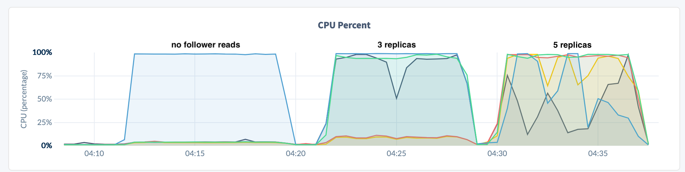

# Reproduce single hot value

The following will setup an environment to reproduce the **single hot value** scenario.  This uses the same cluster configuration and table as the reproduction of the [repo_hot_singlerange_table.md](repo_hot_singlerange_table.md)

**create q1.sql and q1_follower.sql files:**
```bash
cat << EOF > q1.sql
select /*q1*/ count(*), concat(s1,s2,s3,s4,s5) from hotsingle where id between 1 and 500 GROUP BY 2;
EOF

cat << EOF > q1_follower.sql
select /*q1 follower */ count(*), concat(s1,s2,s3,s4,s5) from as of system time follower_read_timestamp() hotsingle where id between 1 and 500 GROUP BY 2;
EOF
```

Monitor the workload from the DB Console to see QPS and CPU actvity as you run the following tests.

**Run without follower reads:**
```bash
workload run querybench --db test --display-every 5s \
                        --query-file q1.sql \
                        --concurrency 45 --duration 300s 
```

**Run with follower reads:**
```bash
workload run querybench --db test --display-every 5s \
                        --query-file q1_follower.sql \
                        --concurrency 45 --duration 300s 
```

**SHOW ZONE CONFIGURATION replicas:**
```sql
SHOW ZONE CONFIGURATION FOR TABLE hotsingle;

     target     |              raw_config_sql
----------------+-------------------------------------------
  RANGE default | ALTER RANGE default CONFIGURE ZONE USING
                |     range_min_bytes = 134217728,
                |     range_max_bytes = 536870912,
                |     gc.ttlseconds = 90000,
                |     num_replicas = 3,
                |     constraints = '[]',
                |     lease_preferences = '[]'
```

**Adjust ZONE configuration to have 5 replias:**
```sql
ALTER TABLE hotsingle CONFIGURE ZONE USING num_replicas = 5;
CONFIGURE ZONE 1
```

....After a few minutes:
```sql
SELECT replicas FROM [SHOW RANGES FROM TABLE hotsingle];
  replicas
------------
  {1,2,3,4,5} 
```

**Run with follower reads and 5 replicas:**
```bash
workload run querybench --db test --display-every 5s \
                        --query-file q1_follower.sql \
                        --concurrency 45 --duration 300s 
```

**Observations from the DB Console:**





Notice how CPU and QPS scales up to utilize all resource on the cluster.

