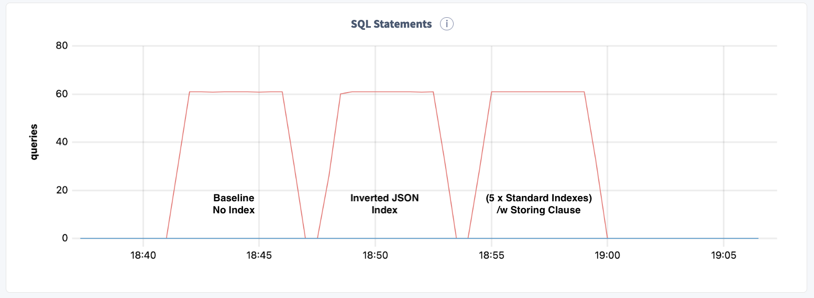
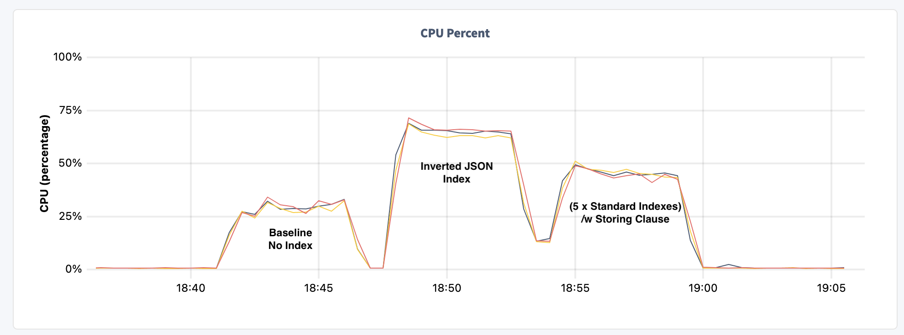

# INSERT Performance with JSONB and Indexes

Recently, I was working with a customer to optimize performance when ingesting JSONB data.  The table containing JSON data needed to be queried based on values in the JSON column.  CockroachDB has the ability to use [inverted](https://www.cockroachlabs.com/docs/stable/inverted-indexes.html) indexes to query based on JSON predicates.  

While inverted indexes work great for _unknown_ JSON fields, better performance can be obtained using [computed](https://www.cockroachlabs.com/docs/stable/jsonb.html#create-a-table-with-a-jsonb-column-and-a-computed-column) columns and creating a traditional index on the computed column. Previously, I wrote a blog regarding [demystifiying](https://glennfawcett.wpcomstaging.com/2020/02/11/demystifying-json-with-cockroachdb-import-index-and-computed-columns/) JSON performance from a query point of view that has details on the performance gains possible.

Regardless, the performance of `INSERT` to tables with JSONB and `INVERTED` indexes needed to be sized for the system for a desired ingest rate.

## Results Highlights

I created three versions of the table with the following attributes:

- Baseline :: Table with no secondary indexes
- Inverted index :: Table with one secondary `INVERTED` index on JSON column
- Computed /w 5 standard :: Table with 5 standard indexes on computed columns of the JSON values

As you can see all three of these tables were able to keep up with the desired `INSERT` rate of 60 QPS.



By looking at CPU, some methods are more expensive in terms of resources.



With any indexing scheme there is an associated cost that must be paid up-front in-order to achieve the best performance during retrieval.  Notice that even with 5 indexes on computed columns it is not as expensive as indexing the entire JSON.  This is good news as the ingest and retrieval cost is less using this method for _known_ values in the JSON.

## Test Details

The test table and [ingest_json.py](ingest_json.py) script are described below.  This script creates a string of values to be inserted.  The JSON object is created with 10 embedded variables `k0 -> k9`.  For the test with the computed columns, 5 of these values are indexed.

Please feel free to experiment with this in your environment and adjust as needed.

### Test Tables

The three tables defined for the test are as follows:

```sql
CREATE TABLE IF NOT EXISTS jtable_base (
    id UUID PRIMARY KEY,
    ts0 TIMESTAMP DEFAULT now(),
    k1 STRING,
    k2 STRING,
    k3 STRING,
    k4 STRING,
    k5 STRING,
    v1 INT,
    v2 INT,
    v3 INT,
    v4 INT,
    v5 INT,
    j JSON
);

CREATE TABLE IF NOT EXISTS jtable_inverted (
    id UUID PRIMARY KEY,
    ts0 TIMESTAMP DEFAULT now(),
    k1 STRING,
    k2 STRING,
    k3 STRING,
    k4 STRING,
    k5 STRING,
    v1 INT,
    v2 INT,
    v3 INT,
    v4 INT,
    v5 INT,
    j JSON,
    INVERTED INDEX inv_j (j)
);

CREATE TABLE IF NOT EXISTS jtable_storing (
    id UUID PRIMARY KEY,
    ts0 TIMESTAMP DEFAULT now(),
    k1 STRING,
    k2 STRING,
    k3 STRING,
    k4 STRING,
    k5 STRING,
    v1 INT,
    v2 INT,
    v3 INT,
    v4 INT,
    v5 INT,
    j JSON,
    jk0 INT8 NULL AS (CAST(j->>'k0':::STRING AS INT8)) STORED,
    jk1 INT8 NULL AS (CAST(j->>'k1':::STRING AS INT8)) STORED,
    jk2 INT8 NULL AS (CAST(j->>'k2':::STRING AS INT8)) STORED,
    jk3 INT8 NULL AS (CAST(j->>'k3':::STRING AS INT8)) STORED,
    jk4 INT8 NULL AS (CAST(j->>'k4':::STRING AS INT8)) STORED,
    INDEX idx_jk0 (jk0 ASC), 
    INDEX idx_jk1 (jk1 ASC), 
    INDEX idx_jk2 (jk2 ASC), 
    INDEX idx_jk3 (jk3 ASC), 
    INDEX idx_jk4 (jk4 ASC) 
);
```

### Python Script

I modified a template that I have been using for running these sorts of tests to create the [ingest_json.py](ingest_json.py) program.  This code basically creates the tables in question and records the results of each run in the `_testruns` table.

```sql
    CREATE TABLE IF NOT EXISTS _testruns (
        id INT PRIMARY KEY DEFAULT nextval('runseq'),
        tablename STRING NOT NULL,
        numthreads INT NOT NULL,
        batchsize INT NOT NULL,
        insertspersec FLOAT as (if(end_ts IS NOT NULL,(rowsinserted)::FLOAT/extract(epoch from (end_ts - start_ts)), 0.0)) STORED,
        p90ms DECIMAL,
        rowsinserted INT,
        description STRING,
        start_ts TIMESTAMPTZ DEFAULT now(),
        end_ts TIMESTAMPTZ
    );
```

The input variables to adjust connection, runtime, etc... are hard-coded for this simple example:

```python
connStr = "postgres://root@127.0.0.1:26257/defaultdb?sslmode=disable"
# Rebuild Settings
rebuildTables = False
resetTests = False

# Define Tables to Test
tables = ['jtable_base', 'jtable_inverted', 'jtable_storing']

# Misc Values
valsPerJSON = 10
distIntPerVal = 10000

# Runtime Per Table
runtime = 300
QPS = 61

# Define batch size tests
batchSize = [50]

# Number of Threads
threadsToRun = [9]

# JSON size and Distribution of values
valsPerJSON = 10
distIntPerVal = 10000
```

I created a JSON generator function to more easily create JSONs of a defined size and define a random range of values:

```python
def jsonKVrand(numberOfPairs, randomRange): 
    ## JSON Creation
    ##
    bigfastvals = ''
    bigfastvals = bigfastvals + "'{"

    for i in range(numberOfPairs):
        if(random.random() < 0.00001):
            rval = str(999999)
        else:  
            rval = str(random.randint(1, randomRange))
        bigfastvals = bigfastvals + '"k' + str(i) + '":"' + rval + '"'
        if (i != numberOfPairs - 1):
            bigfastvals = bigfastvals + ','

    bigfastvals = bigfastvals + "}'" 
    
    return bigfastvals
```

Please feel free to modify and expand to suit your needs.
